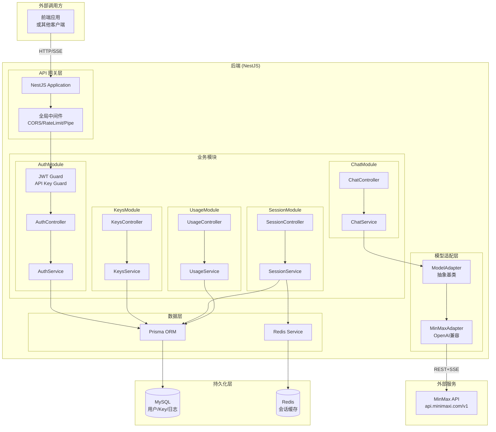

# Agent 平台后端架构设计

## 系统架构图



## 技术栈

| 层级 | 技术选型 |
|------|---------|
| 后端框架 | NestJS |
| 数据库 | MySQL + Prisma ORM |
| 缓存 | Redis |
| 认证 | JWT + API Key |
| 流式传输 | Server-Sent Events (SSE) |
| 容器化 | Docker + Docker Compose |
| 模型接口 | OpenAI API 兼容格式 |
| API 文档 | Swagger (自动生成) |

## 项目结构

```
backend/
├── src/
│   ├── adapters/           # 模型适配层
│   │   ├── base.adapter.ts  # 抽象基类
│   │   └── minmax.adapter.ts
│   ├── auth/               # 认证模块
│   │   ├── auth.module.ts
│   │   ├── auth.controller.ts
│   │   ├── auth.service.ts
│   │   ├── dto/
│   │   ├── guards/
│   │   └── strategies/
│   ├── keys/               # API Key 管理模块
│   ├── chat/               # 聊天模块
│   ├── session/            # 会话管理模块
│   ├── usage/              # 用量统计模块
│   ├── prisma/
│   │   ├── prisma.service.ts
│   │   └── schema.prisma
│   ├── redis/
│   │   └── redis.service.ts
│   ├── common/
│   ├── docs/
│   ├── app.module.ts
│   └── main.ts
├── docker-compose.yml
├── Dockerfile
└── package.json
```

## 数据库模型

### User
| 字段 | 类型 | 描述 |
|------|------|------|
| id | UUID | 主键 |
| email | String | 唯一邮箱 |
| password | String | bcrypt 加密密码 |
| name | String? | 用户名 |
| createdAt | DateTime | 创建时间 |
| updatedAt | DateTime | 更新时间 |

### ApiKey
| 字段 | 类型 | 描述 |
|------|------|------|
| id | UUID | 主键 |
| key | String | SHA256 哈希后的 Key |
| name | String | Key 名称 |
| userId | String | 所属用户 |
| quota | Int | 配额 (0=无限) |
| used | Int | 已使用次数 |
| expiresAt | DateTime? | 过期时间 |
| isActive | Boolean | 是否启用 |

### Session
| 字段 | 类型 | 描述 |
|------|------|------|
| id | UUID | 主键 |
| userId | String | 所属用户 |
| title | String | 会话标题 |
| createdAt | DateTime | 创建时间 |
| updatedAt | DateTime | 更新时间 |

### Message
| 字段 | 类型 | 描述 |
|------|------|------|
| id | UUID | 主键 |
| sessionId | String | 所属会话 |
| role | String | user/assistant/system |
| content | LongText | 消息内容 |
| metadata | Json? | 元数据 |

### UsageLog
| 字段 | 类型 | 描述 |
|------|------|------|
| id | UUID | 主键 |
| apiKeyId | String | 关联 API Key |
| model | String | 模型名称 |
| inputTokens | Int | 输入 Token 数 |
| outputTokens | Int | 输出 Token 数 |
| cost | Float | 费用 |
| metadata | Json? | 额外信息 |
| createdAt | DateTime | 创建时间 |

## API 接口

### 认证模块 (/api/auth)

| 方法 | 路径 | 描述 | 认证 |
|------|------|------|------|
| POST | /api/auth/register | 用户注册 | 否 |
| POST | /api/auth/login | 用户登录 | 否 |
| GET | /api/auth/me | 获取当前用户信息 | JWT |

### API Key 管理 (/api/keys)

| 方法 | 路径 | 描述 | 认证 |
|------|------|------|------|
| GET | /api/keys | 获取 Key 列表 | JWT |
| POST | /api/keys | 创建新 Key | JWT |
| PATCH | /api/keys/:id | 更新 Key | JWT |
| DELETE | /api/keys/:id | 删除 Key | JWT |
| GET | /api/keys/:id/usage | 使用统计 | JWT |

### 会话管理 (/api/sessions)

| 方法 | 路径 | 描述 | 认证 |
|------|------|------|------|
| GET | /api/sessions | 获取会话列表 | JWT |
| POST | /api/sessions | 创建新会话 | JWT |
| GET | /api/sessions/:id | 获取会话详情 | JWT |
| PATCH | /api/sessions/:id | 更新会话 | JWT |
| DELETE | /api/sessions/:id | 删除会话 | JWT |

### 聊天 (/api/chat)

| 方法 | 路径 | 描述 | 认证 |
|------|------|------|------|
| GET | /api/chat/models | 获取模型列表 | 否 |
| POST | /api/chat/stream | 流式聊天 (SSE) | JWT/API Key |
| POST | /api/chat/complete | 同步聊天 | JWT/API Key |

### 用量统计 (/api/usage)

| 方法 | 路径 | 描述 | 认证 |
|------|------|------|------|
| GET | /api/usage/summary | 用量汇总 | JWT |
| GET | /api/usage/logs | 用量日志 | JWT |
| GET | /api/usage/by-key/:id | 指定 Key 用量 | JWT |

## 环境变量

| 变量 | 描述 | 默认值 |
|------|------|--------|
| DATABASE_URL | MySQL 连接 URL | - |
| REDIS_URL | Redis 连接 URL | redis://localhost:6379 |
| JWT_SECRET | JWT 密钥 | default-secret |
| JWT_EXPIRES_IN | JWT 过期时间 | 7d |
| PORT | 服务端口 | 3000 |
| NODE_ENV | 运行环境 | development |
| MINMAX_BASE_URL | MinMax API 地址 | https://api.minimaxi.com/v1 |

## 启动方式

### 开发环境
```bash
pnpm install
pnpm run start:dev
```

### Docker
```bash
docker-compose up -d
```

### 访问 API 文档
http://localhost:3000/api/docs
